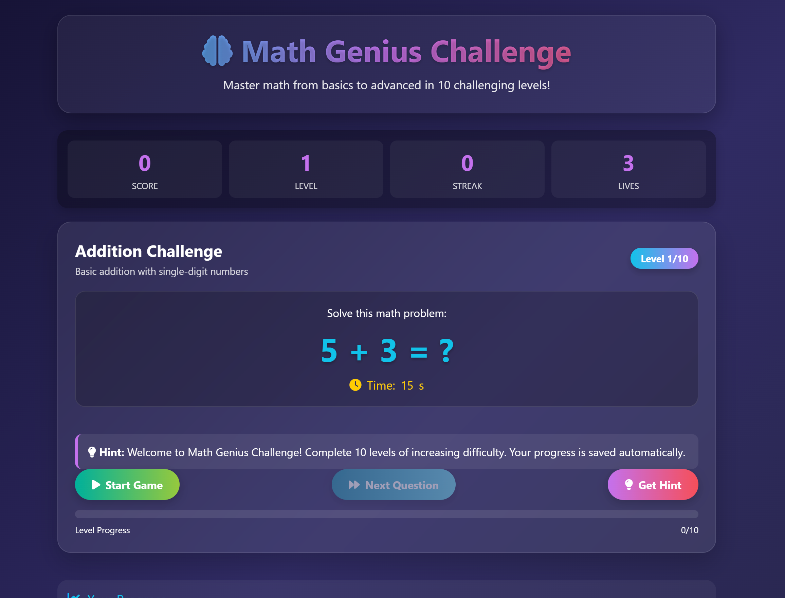

# 🧠 Math Genius Challenge – Interactive Learning Game

**Math Genius Challenge** is a highly engaging, visually attractive web-based math game designed to turn beginners into math geniuses through progressive levels, challenges, speed-based questions, logic building, and rewarding gameplay mechanics. It blends education with fun to create an addictive and effective learning experience.

---

## 📖 About the Project

Math Genius Challenge helps players strengthen their mathematical skills through **10 progressively challenging levels**, ranging from basic arithmetic to advanced multi-operation problems. The game features scoring systems, streak bonuses, achievements, timers, and animated feedback to keep users motivated and focused.

---

## ✨ Key Features

- 🎯 **10 Progressive Levels** – From simple addition to complex mixed operations  
- ➕➖✖️➗ **Multiple Operations** – Addition, subtraction, multiplication, division, exponents, and roots  
- 🏆 **Achievement System** – 8 unlockable achievements to track mastery  
- 💾 **Progress Saving** – High scores and achievements saved using local storage  
- 📱 **Responsive Design** – Optimized for desktop, tablet, and mobile devices  
- 🎨 **Visual Feedback** – Animations, progress bars, streak effects, and instant feedback  
- ⏱️ **Time Challenges** – Decreasing time limits as levels increase  
- 💡 **Hint System** – Helpful hints when players get stuck  

---

## 🎮 How to Play

1. Click **Start Game**  
2. Solve the math problem before the timer runs out  
3. Select the correct answer from four options  
4. Earn points for correct and quick answers  
5. Build streaks for bonus points  
6. Complete levels to unlock harder challenges  
7. Use hints wisely if needed  

---

## 📊 Levels Overview

| Level | Name | Description | Operations |
|------|------|------------|------------|
| 1 | Addition Basics | Simple addition (1–10) | + |
| 2 | Subtraction Basics | Simple subtraction (1–20) | - |
| 3 | Mixed Operations | Addition & subtraction (1–30) | +, - |
| 4 | Multiplication Basics | Multiplication (1–10) | × |
| 5 | Division Basics | Division (up to 50) | ÷ |
| 6 | Mixed Challenge | All four operations | +, -, ×, ÷ |
| 7 | Advanced Arithmetic | Two-step problems (up to 100) | +, -, ×, ÷ |
| 8 | Exponents & Roots | Squares & square roots | ^, √ |
| 9 | Fractions | Fraction operations | +, - |
| 10 | Master Challenge | Complex mixed problems | +, -, ×, ÷, ^, √ |

---

## 🏆 Achievements

- **First Steps** – Answer 10 questions  
- **Quick Thinker** – Answer 5 questions in under 5 seconds  
- **Math Whiz** – Reach level 5  
- **Perfect Streak** – 15 correct answers in a row  
- **Math Master** – Reach level 10  
- **Speed Demon** – Answer 30 questions quickly  
- **Division Expert** – Solve 10 division problems correctly  
- **High Scorer** – Score over 1000 points  

---

## 🚀 Live Demo

Play the game here:  
👉 https://mohakamran.github.io/math/

---

## 🛠️ Technologies Used

- **HTML5** – Structure and content  
- **CSS3** – Styling, animations, and responsive design  
- **JavaScript** – Game logic and interactivity  
- **Font Awesome** – Icons and visual elements  
- **Local Storage** – Saving progress and achievements  
- **GitHub Pages** – Hosting  

---

## 📁 Project Structure

math/
│
├── index.html # Main game file
├── Screenshot.png # Game screenshot
├── README.md # Documentation

> The entire game is contained in a single HTML file with embedded CSS and JavaScript.

---

## 🔧 Setup & Installation

1. Clone or download the repository  
to clone repo: git clone https://github.com/mohakamran/math.git
cd math
2. Open `index.html` in any modern web browser  
3. Start playing – no setup or dependencies required  

---

## 🎯 Game Mechanics

### Scoring System
- Base points: `10 × current level`
- Quick answer bonus: `+5 to +10`
- Streak bonuses for consecutive correct answers  

### Lives System
- Start with **3 lives**
- Lose a life for wrong answers or timeouts
- Game over when lives reach zero  

### Timer
- Level 1: 15 seconds per question  
- Level 10: 8 seconds per question  
- Timer color changes as time runs low  

---

## 📱 Responsive Design

- **Desktop**: Grid layout with two-column options  
- **Tablet**: Optimized spacing and scaling  
- **Mobile**: Single-column layout with touch-friendly buttons  

---

## 🤝 Contributing

Contributions are welcome!  
Feel free to fork the repository, create a feature branch, and submit a pull request.

---

## 📄 License

This project is open source and available for educational and personal use.

---

## 🙏 Acknowledgments

- Inspired by educational games that make learning fun  
- Built with pure HTML, CSS, and JavaScript  
- Icons by Font Awesome  
- UI inspired by modern gradient-based design trends  
